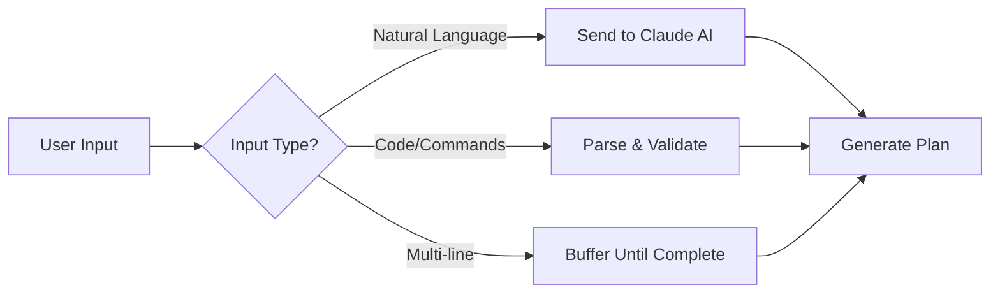
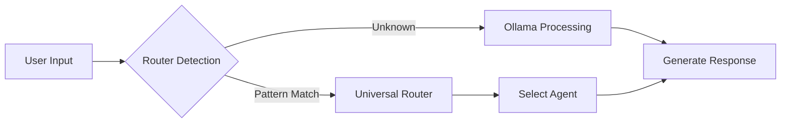

# Claude Code CLI vs Bruno CLI: Workflow & Architecture Comparison

## System Architecture Overview

### Claude Code CLI Architecture
```
┌─────────────────┐     ┌──────────────────┐     ┌─────────────────┐
│  Claude Code    │────▶│   Claude AI      │────▶│  Local Tools    │
│  CLI (UI/UX)    │◀────│  (Orchestrator)  │◀────│   (Executors)   │
└─────────────────┘     └──────────────────┘     └─────────────────┘
       │                         │                         │
       │                         │                         │
    ┌──▼───────┐          ┌─────▼──────┐         ┌───────▼────────┐
    │  Input   │          │  Planning  │         │   Execution    │
    │  Parser  │          │ Validation │         │   Results      │
    └──────────┘          └────────────┘         └────────────────┘
```

### Bruno CLI Architecture
```
┌─────────────────┐     ┌──────────────────┐     ┌─────────────────┐
│   Bruno CLI     │────▶│  Local Ollama    │────▶│ Shell Sandbox   │
│  (UI/UX)        │◀────│ (Orchestrator)   │◀────│  (Executor)     │
└─────────────────┘     └──────────────────┘     └─────────────────┘
       │                         │                         │
       │                         │                         │
    ┌──▼───────┐          ┌─────▼──────┐         ┌───────▼────────┐
    │  Router  │          │   Agent    │         │    Tools       │
    │  System  │          │   Chain    │         │   Router       │
    └──────────┘          └────────────┘         └────────────────┘
```

## Side-by-Side Workflow Comparison

### 1. Input Processing Workflow

| Aspect | Claude Code CLI | Bruno CLI |
|--------|-----------------|-----------|
| **Input Method** | Natural language, code, multi-line | Natural language, code, multi-line (with --claude) |
| **Input Parser** | Cloud-based NLP | Local pattern matching + Ollama |
| **Context Awareness** | Full conversation history | Session-based memory |
| **Multi-modal** | Text + Images | Text only (currently) |

#### Claude Code CLI Input Flow:


#### Bruno CLI Input Flow:


### 2. Planning & Orchestration Workflow

| Component | Claude Code CLI | Bruno CLI |
|-----------|-----------------|-----------|
| **Planner** | Claude AI (Cloud) | Ollama + Local Patterns |
| **Validation** | Real-time with AI | Pre-execution checks |
| **Error Handling** | AI-guided recovery | Rule-based fallbacks |
| **Task Decomposition** | Dynamic AI analysis | Template-based |

#### Claude Code CLI Planning:
```yaml
Input: "Create a full-stack app with auth"
Process:
  1. AI Analysis:
     - Understands full context
     - Generates comprehensive plan
     - Validates feasibility
  2. Task Breakdown:
     - Frontend setup
     - Backend API
     - Database schema
     - Authentication flow
  3. Execution Plan:
     - Ordered steps with dependencies
     - Rollback strategies
     - Success criteria
```

#### Bruno CLI Planning:
```yaml
Input: "Create a full-stack app with auth"
Process:
  1. Pattern Recognition:
     - Matches "create" + "fullstack"
     - Routes to appropriate agent
  2. Template Selection:
     - Predefined app templates
     - Auth module selection
  3. Local LLM Enhancement:
     - Ollama refines the plan
     - Adds project-specific details
```

### 3. Execution Workflow

| Feature | Claude Code CLI | Bruno CLI |
|---------|-----------------|-----------|
| **Executor** | MCP Servers + Tools | Shell Sandbox + Tools |
| **Streaming** | Real-time output | Real-time output (with --claude) |
| **File Operations** | Direct FS access | Sandboxed FS access |
| **Network Calls** | Allowed | Restricted by default |

#### Claude Code CLI Execution:
```javascript
// Execution Flow
1. Receive approved plan from AI
2. Execute each step via MCP tools:
   - FileSystem.write()
   - Shell.execute()
   - Git.commit()
3. Stream results back to UI
4. AI monitors progress
5. Adaptive error correction
```

#### Bruno CLI Execution:
```javascript
// Execution Flow
1. Receive plan from router/LLM
2. Execute via sandboxed tools:
   - fsHandler.writeFile()
   - shellSandbox.execute()
   - Restricted operations
3. Stream results (if claude mode)
4. Local validation
5. Fallback on errors
```

### 4. Output & UI/UX Workflow

| Aspect | Claude Code CLI | Bruno CLI |
|--------|-----------------|-----------|
| **Output Format** | Conversational + Code | Structured + Code |
| **Progress Indicators** | Inline updates | Spinner/status (enhanced mode) |
| **Error Display** | Contextual explanations | Technical error messages |
| **Code Highlighting** | Syntax highlighted | Basic highlighting |

#### Claude Code CLI Output:
```
🤔 Understanding your request...

I'll help you create a React dashboard. Here's what I'll do:

1. Set up the project structure
2. Install necessary dependencies
3. Create the dashboard component
4. Add routing and navigation

$ npx create-react-app dashboard
Creating a new React app in /Users/you/dashboard.
Installing packages...

$ cd dashboard && npm install react-router-dom axios
added 52 packages in 3.241s

📝 Creating Dashboard.jsx
[Shows highlighted code]

✅ Dashboard created successfully!
```

#### Bruno CLI Output:
```
🤖 Bruno v3.1 - Processing request...

📊 Task Analysis:
Type: Frontend Creation
Pattern: React Dashboard
Enhancements: Local LLM

🔧 Executing:
$ npx create-react-app dashboard
[output streams in real-time with --claude]

📝 Generated Files:
- src/Dashboard.jsx
- src/routes.js
- src/api/client.js

✅ Task completed
```

### 5. Validation & Checking Workflow

| Feature | Claude Code CLI | Bruno CLI |
|---------|-----------------|-----------|
| **Pre-validation** | AI checks before execution | Pattern-based checks |
| **Runtime validation** | Continuous AI monitoring | Exit code checking |
| **Post-validation** | AI verifies results | Basic success/fail |
| **Correction** | AI can auto-fix issues | Manual intervention |

## Detailed Workflow Comparison

### A. Simple Command Workflow

**Input:** `"Show me the current git status"`

#### Claude Code CLI:
```
1. Input → Claude AI
2. AI recognizes git command
3. Executes: git status
4. AI interprets output
5. Presents formatted result with explanation
```

#### Bruno CLI:
```
1. Input → Pattern matcher
2. Recognizes "git status" pattern
3. Routes to shell executor
4. Executes: git status
5. Returns raw output
```

### B. Complex Multi-Step Workflow

**Input:** `"Set up a Node.js API with authentication and deploy to Vercel"`

#### Claude Code CLI:
```
1. Input Analysis
   - AI understands full requirement
   - Plans complete architecture
   
2. Interactive Planning
   - Shows step-by-step plan
   - Asks for confirmations if needed
   
3. Execution
   - Creates project structure
   - Implements auth system
   - Configures deployment
   - Each step validated by AI
   
4. Deployment
   - AI handles Vercel config
   - Monitors deployment
   - Provides live URL
   
5. Validation
   - AI tests the endpoints
   - Confirms auth working
```

#### Bruno CLI:
```
1. Pattern Recognition
   - Matches "Node.js API" + "auth" + "deploy"
   - Selects appropriate templates
   
2. Local LLM Enhancement
   - Ollama generates specifics
   - Uses predefined patterns
   
3. Execution
   - Runs template scripts
   - Basic error checking
   - Sequential execution
   
4. Deployment
   - Uses Vercel CLI if available
   - Follows standard process
   
5. Completion
   - Reports success/failure
   - No active validation
```

### C. Error Recovery Workflow

**Scenario:** `npm install` fails due to peer dependency conflict

#### Claude Code CLI:
```
1. Error Detection
   - AI recognizes npm error
   
2. Analysis
   - AI reads error details
   - Understands dependency conflict
   
3. Solution
   - AI proposes fixes:
     * Use --legacy-peer-deps
     * Update conflicting packages
     * Modify package.json
   
4. Execution
   - AI tries solutions in order
   - Monitors results
   
5. Success
   - Confirms installation works
   - Explains what was fixed
```

#### Bruno CLI:
```
1. Error Detection
   - Command exits with error code
   
2. Error Display
   - Shows npm error output
   
3. Fallback
   - Suggests common fixes
   - Requires user decision
   
4. Manual Retry
   - User must run fix
   
5. Completion
   - Reports new status
```

## UI/UX Comparison

### Input Experience

| Feature | Claude Code CLI | Bruno CLI |
|---------|-----------------|-----------|
| **Prompt Design** | Minimal, clean `>` | Configurable prompt |
| **Multi-line Input** | Automatic detection | Requires --claude flag |
| **Code Pasting** | Natural, no modes | Natural with --claude |
| **Autocomplete** | Context-aware | Basic command completion |

### Output Experience

| Feature | Claude Code CLI | Bruno CLI |
|---------|-----------------|-----------|
| **Formatting** | Rich, conversational | Structured, technical |
| **Colors** | Semantic coloring | Basic syntax colors |
| **Progress** | Inline status updates | Spinner animations |
| **Explanations** | Always explains actions | Minimal explanations |

### Error Experience

| Feature | Claude Code CLI | Bruno CLI |
|---------|-----------------|-----------|
| **Error Messages** | Human-friendly | Technical details |
| **Suggestions** | AI-generated fixes | Predefined suggestions |
| **Recovery** | Automatic attempts | Manual recovery |
| **Learning** | Explains why it failed | Shows what failed |

## Key Architectural Differences

### 1. Intelligence Layer

**Claude Code CLI:**
- Cloud-based AI brain
- Full context understanding
- Dynamic adaptation
- Learns from interaction

**Bruno CLI:**
- Local LLM (Ollama)
- Pattern-based routing
- Template-driven
- Static behavior

### 2. Execution Model

**Claude Code CLI:**
- AI-supervised execution
- Adaptive error handling
- Real-time validation
- Intelligent rollback

**Bruno CLI:**
- Direct execution
- Basic error checking
- Sequential processing
- Manual rollback

### 3. Privacy & Performance

**Claude Code CLI:**
- Requires internet
- Cloud processing
- Richer capabilities
- Privacy considerations

**Bruno CLI:**
- 100% offline capable
- Local processing
- Predictable performance
- Complete privacy

## Summary Comparison Table

| Aspect | Claude Code CLI | Bruno CLI | Winner |
|--------|-----------------|-----------|---------|
| **Natural Language** | Excellent | Good (with Ollama) | Claude |
| **Multi-line Input** | Native | Requires flag | Claude |
| **Privacy** | Cloud-based | 100% local | Bruno |
| **Offline Work** | Not possible | Fully supported | Bruno |
| **Error Recovery** | Intelligent | Basic | Claude |
| **Execution Speed** | Network dependent | Fast local | Bruno |
| **Learning Ability** | Continuous | Static | Claude |
| **Customization** | Limited | Extensive | Bruno |
| **Complex Tasks** | Excellent | Good | Claude |
| **Resource Usage** | Low (cloud) | Higher (local LLM) | Claude |

## Recommendations

### Use Claude Code CLI When:
- Working on complex projects
- Need intelligent error recovery  
- Want conversational interaction
- Have reliable internet
- Value AI-guided development

### Use Bruno CLI When:
- Need offline capability
- Want complete privacy
- Prefer local control
- Have limited internet
- Need predictable behavior

### Hybrid Approach:
The ideal setup might be using Claude Code CLI for planning and validation, then Bruno CLI for execution in secure/offline environments.