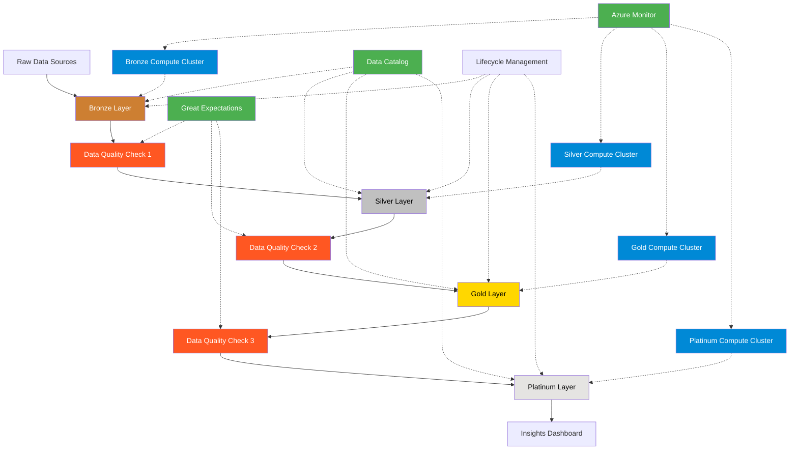

# Project Scout: Alignment with Databricks Medallion Azure Well-Architected Framework

## Executive Summary

This document assesses the Project Scout Juicer GenAI Insights implementation against the Databricks Medallion Azure Well-Architected Framework. It identifies current alignment, gaps, and provides recommendations for better adherence to framework principles.

## Medallion Architecture Alignment

| Layer | Current Implementation | Framework Recommendation | Alignment | Gap | Recommendation |
|-------|------------------------|--------------------------|-----------|-----|----------------|
| **Bronze** | Raw ingestion of transcript data | Raw data in Delta format with schema enforcement | ✅ Aligned | None | None |
| **Silver** | Brand extraction and sentiment analysis | Normalized, cleansed data with business logic | ✅ Aligned | Missing data validation | Add data quality metrics |
| **Gold** | Reconstructed transcripts for analysis | Denormalized, aggregated data for reporting | ✅ Aligned | None | None |
| **Platinum** | GenAI insights with confidence scoring | Business-level aggregates and insights | ✅ Aligned | No formal metric tracking | Add insight quality metrics |

## Framework Pillar Alignment

### 1. Cost Optimization

| Component | Current State | Framework Recommendation | Gap |
|-----------|---------------|--------------------------|-----|
| **Compute Isolation** | Single cluster for all workloads | Separate compute for each layer | ❌ Missing dedicated compute per layer |
| **Auto-scaling** | Fixed 2-worker cluster | Auto-scaling based on workload | ❌ Missing auto-scaling configuration |
| **Auto-termination** | 60-minute termination | Workload-optimized termination | ⚠️ May need refinement |
| **Storage Tiering** | Single storage tier | Hot/Cool/Archive tiering | ❌ Missing storage lifecycle management |
| **Job Scheduling** | Basic daily/weekly jobs | Optimized scheduling with dependencies | ⚠️ Missing job dependencies |

**Recommendations:**
1. Implement separate compute clusters for bronze/silver and gold/platinum layers
2. Configure auto-scaling based on workload patterns (2-8 workers)
3. Implement storage lifecycle policies for aging data
4. Enhance job scheduling with proper dependencies

### 2. Reliability

| Component | Current State | Framework Recommendation | Gap |
|-----------|---------------|--------------------------|-----|
| **Data Quality** | Not implemented | Automated quality checks at each layer | ❌ Missing quality checks |
| **Fault Tolerance** | Basic job retry | Comprehensive error handling | ⚠️ Limited error handling |
| **Monitoring** | Basic job success/failure | End-to-end monitoring | ❌ Missing detailed monitoring |
| **Disaster Recovery** | Not implemented | Point-in-time recovery | ❌ Missing disaster recovery |
| **Idempotency** | Not explicitly implemented | Idempotent operations | ⚠️ Partial implementation |

**Recommendations:**
1. Implement Great Expectations or similar data quality framework
2. Add comprehensive error handling and retry logic
3. Configure Azure Monitor for complete workflow visibility
4. Establish point-in-time recovery capabilities
5. Ensure all transformations are idempotent

### 3. Operational Excellence

| Component | Current State | Framework Recommendation | Gap |
|-----------|---------------|--------------------------|-----|
| **CI/CD** | Basic GitHub workflow | Full CI/CD with testing | ⚠️ Limited testing coverage |
| **Infrastructure as Code** | Partial (setup scripts) | Full IaC with ARM/Terraform | ⚠️ Partial implementation |
| **Change Management** | GitHub-based | Full change management process | ⚠️ Limited governance |
| **Documentation** | Comprehensive | Living documentation | ✅ Aligned |
| **Alerting** | Basic email on failure | Comprehensive alerting framework | ❌ Limited alerting |

**Recommendations:**
1. Enhance CI/CD with comprehensive testing
2. Convert setup scripts to proper ARM templates or Terraform
3. Implement formal change management process
4. Develop comprehensive alerting framework with escalation paths

### 4. Performance Efficiency

| Component | Current State | Framework Recommendation | Gap |
|-----------|---------------|--------------------------|-----|
| **Query Optimization** | Basic | Query optimization with metrics | ❌ Missing optimization |
| **Caching** | Not implemented | Appropriate query caching | ❌ Missing caching strategy |
| **Partition Strategy** | Not explicitly defined | Optimized partitioning | ❌ Missing partition strategy |
| **Workload Management** | Basic | Advanced workload management | ❌ Missing workload management |
| **Spark Configuration** | Default | Workload-specific tuning | ❌ Missing Spark tuning |

**Recommendations:**
1. Implement query optimization and monitoring
2. Define appropriate caching strategy
3. Optimize partition strategy for each table
4. Implement workload management
5. Tune Spark configurations for specific workloads

### 5. Security

| Component | Current State | Framework Recommendation | Gap |
|-----------|---------------|--------------------------|-----|
| **Authentication** | Azure AD | Azure AD with conditional access | ⚠️ Basic implementation |
| **Authorization** | Basic RBAC | Table and column-level security | ❌ Missing fine-grained access |
| **Data Encryption** | Enabled | End-to-end encryption | ✅ Aligned |
| **Secret Management** | Key Vault | Automated secret rotation | ⚠️ Missing rotation |
| **Network Security** | Basic | Private endpoints and NSGs | ❌ Missing private endpoints |

**Recommendations:**
1. Enable Azure AD conditional access
2. Implement table and column-level security
3. Configure automated secret rotation
4. Implement private endpoints for all services
5. Add network security groups

## Implementation Plan for Alignment

### Phase 1: Critical Framework Alignment (1-2 Weeks)

1. **Data Quality Framework**:
   - Implement Great Expectations for data quality checks
   - Add quality gates between medallion layers
   - Configure automated quality reporting

2. **Compute Optimization**:
   - Create dedicated compute clusters for each medallion layer
   - Configure auto-scaling based on workload
   - Optimize auto-termination settings

3. **Monitoring and Alerting**:
   - Implement Azure Monitor for all components
   - Configure comprehensive alerting
   - Add operational dashboards

### Phase 2: Enhanced Framework Alignment (2-4 Weeks)

1. **Infrastructure as Code**:
   - Convert all setup scripts to ARM templates
   - Implement deployment validation
   - Add environment templates (dev/stage/prod)

2. **Performance Optimization**:
   - Implement partition strategy for all tables
   - Optimize query patterns
   - Configure appropriate caching

3. **Security Enhancements**:
   - Implement private endpoints
   - Configure table and column-level security
   - Implement automated secret rotation

### Phase 3: Advanced Framework Alignment (4-6 Weeks)

1. **Advanced Workload Management**:
   - Implement dynamic resource allocation
   - Configure job prioritization
   - Optimize resource utilization

2. **Disaster Recovery**:
   - Implement point-in-time recovery
   - Configure cross-region redundancy
   - Develop disaster recovery playbooks

3. **Governance and Compliance**:
   - Implement comprehensive audit logging
   - Configure compliance reporting
   - Add data lineage tracking

## Medallion Architecture Enhancement Diagram

## Conclusion

While the current Project Scout implementation follows many of the Databricks Medallion Azure Well-Architected Framework principles, there are several opportunities for enhancement. The most critical gaps are in the areas of:

1. **Compute Isolation and Optimization**
2. **Data Quality and Monitoring**
3. **Security and Network Configuration**
4. **Performance Optimization**

Implementing the recommended actions in the phased approach will significantly improve the architecture's alignment with the framework, resulting in better performance, reliability, security, and cost optimization.

---

*This alignment assessment was prepared on May 12, 2025 and should be reviewed quarterly to ensure continued alignment with framework best practices.*