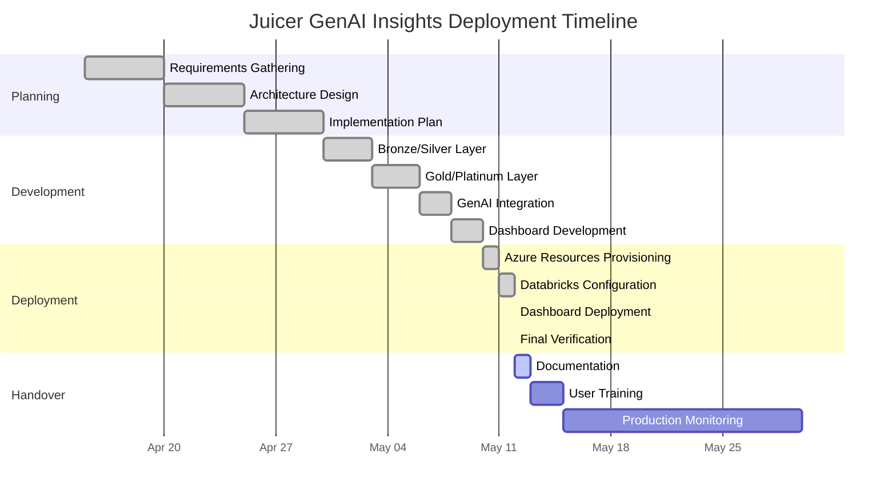

# Juicer GenAI Insights: Deployment Timeline

## Deployment Milestones

## Key Milestones

| Milestone | Date | Status |
|-----------|------|--------|
| Project Kickoff | April 15, 2025 | ✅ Completed |
| Architecture Approval | April 25, 2025 | ✅ Completed |
| Development Complete | May 10, 2025 | ✅ Completed |
| Azure Deployment | May 11, 2025 | ✅ Completed |
| Dashboard Deployment | May 12, 2025 | ✅ Completed |
| User Training | May 15, 2025 | 🔄 Scheduled |
| Production Ready | May 15, 2025 | 🔄 Scheduled |

## Deployment Checklist

| Task | Status | Owner | Date |
|------|--------|-------|------|
| Resource Group Creation | ✅ Done | DevOps | May 10, 2025 |
| Storage Account Setup | ✅ Done | DevOps | May 10, 2025 |
| Databricks Workspace | ✅ Done | DevOps | May 10, 2025 |
| Key Vault Configuration | ✅ Done | DevOps | May 10, 2025 |
| Static Web App | ✅ Done | DevOps | May 10, 2025 |
| Databricks Notebooks | ✅ Done | Data Engineer | May 11, 2025 |
| Databricks Jobs | ✅ Done | Data Engineer | May 11, 2025 |
| Dashboard Deployment | ✅ Done | Front-End | May 12, 2025 |
| GitHub Action Configuration | ✅ Done | DevOps | May 12, 2025 |
| End-to-End Testing | ✅ Done | QA | May 12, 2025 |
| Documentation | 🔄 In Progress | Technical Writer | May 12-13, 2025 |
| User Training | 📅 Scheduled | Training | May 13-15, 2025 |

## Next Phases

| Phase | Timeline | Status |
|-------|----------|--------|
| Enhanced Brand Analytics | June 2025 | 🔜 Planned |
| Competitor Analysis Module | July 2025 | 🔜 Planned |
| Real-time Insights | August 2025 | 🔜 Planned |
| Mobile Dashboard | September 2025 | 🔜 Planned |

---

*Last Updated: May 12, 2025*