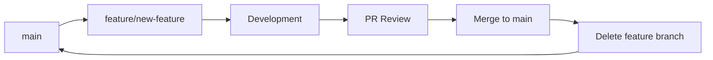

# Branch Policy for Client360 Dashboard Project

## Overview

This document establishes the branch management policy for the Client360 Dashboard project to maintain a clean, professional repository suitable for client delivery.

## Current Status (Post v1.0 Cleanup)

✅ **Completed**: All dashboard feature branches have been merged and deleted  
✅ **Status**: Repository cleaned for v1.0 release  
✅ **Branches Removed**:
- `feature/transaction-heatmap-2025523`
- `feature/customer-profiling-2025523` 
- `feature/consumer-behavior-analysis-2025523`
- `feature/transaction-trends-poc-2025523`
- `superset-deployment`
- `chore/cleanup-nav-and-brand-grid`

## Branch Strategy Going Forward

### Protected Branches

- **`main`**: Production-ready code, client-deployable
- **`develop`** (optional): Integration branch for future features

### Naming Conventions

```
feature/JIRA-123-short-description
bugfix/JIRA-456-fix-description
hotfix/critical-issue-description
release/v1.1.0
```

### Workflow Rules

1. **All feature work** must be branched from `main`
2. **No direct commits** to `main` branch
3. **All branches** must be deleted after successful merge
4. **PR reviews** required for all merges to `main`
5. **Feature branches** should be short-lived (< 1 week)

## Branch Lifecycle



## Enforcement Mechanisms

### Automated Cleanup

```bash
# Weekly cleanup script (can be automated with GitHub Actions)
./cleanup_dashboard_branches.sh
```

### GitHub Branch Protection Rules

Recommended settings for `main` branch:
- ✅ Require pull request reviews before merging
- ✅ Require status checks to pass before merging
- ✅ Require branches to be up to date before merging
- ✅ Require conversation resolution before merging
- ✅ Delete head branches automatically

### Pre-merge Checklist

Before merging any feature branch:
- [ ] Code review completed
- [ ] Tests passing
- [ ] Documentation updated
- [ ] Whitelabeling compliance verified
- [ ] No internal branding or AI signatures

## Client Presentation Standards

### What Clients See
- Clean commit history on `main`
- Professional branch names (no internal references)
- Clear, business-focused commit messages
- Tagged releases (v1.0.0, v1.1.0, etc.)

### What Clients Don't See
- Development branch clutter
- Internal tooling references
- AI assistant signatures
- Experimental or POC branches

## Release Process

### Version Tagging
```bash
# Create annotated tag for releases
git tag -a v1.0.0 -m "Client360 Dashboard v1.0.0 Release

Features:
- Consumer Behavior Analysis
- Customer Profiling  
- Transaction Trends
- Geographic Heatmaps

Ready for production deployment."

git push origin v1.0.0
```

### Release Branches
For major releases, create temporary release branches:
```bash
git checkout -b release/v1.1.0
# Final testing and bug fixes
git checkout main
git merge --no-ff release/v1.1.0
git tag -a v1.1.0 -m "Release v1.1.0"
git branch -d release/v1.1.0
```

## Developer Guidelines

### Creating Feature Branches
```bash
# Always start from latest main
git checkout main
git pull origin main
git checkout -b feature/JIRA-123-new-dashboard-widget

# Work on feature
git add .
git commit -m "feat: add new dashboard widget for client analytics"

# Push and create PR
git push origin feature/JIRA-123-new-dashboard-widget
```

### Cleaning Up After Merge
```bash
# After PR is merged, clean up locally
git checkout main
git pull origin main
git branch -d feature/JIRA-123-new-dashboard-widget
```

## Emergency Procedures

### Hotfix Process
```bash
# For critical production issues
git checkout main
git checkout -b hotfix/critical-data-issue
# Fix the issue
git commit -m "fix: resolve critical data display issue"
# Immediate merge without normal review process
git checkout main
git merge hotfix/critical-data-issue
git push origin main
git branch -d hotfix/critical-data-issue
```

### Branch Recovery
If a branch is accidentally deleted:
```bash
# Find the commit hash
git reflog
# Recreate the branch
git checkout -b recovered-branch <commit-hash>
```

## Monitoring and Maintenance

### Weekly Tasks
- [ ] Review open PRs
- [ ] Delete merged branches
- [ ] Check for stale branches (> 2 weeks old)
- [ ] Verify branch protection rules

### Monthly Tasks
- [ ] Review branch policy effectiveness
- [ ] Update naming conventions if needed
- [ ] Archive old release branches
- [ ] Update this document

## Compliance with Client Standards

This branch policy ensures:
- ✅ Professional repository appearance
- ✅ Clear development history
- ✅ Reduced security surface area
- ✅ Simplified maintenance
- ✅ Client-ready deliverables

## Questions or Issues

For questions about this branch policy:
1. Check this document first
2. Review recent merge patterns on `main`
3. Consult with the development team lead
4. Update this policy as needed for project evolution

---

**Last Updated**: May 24, 2025  
**Policy Version**: 1.0  
**Next Review**: June 24, 2025