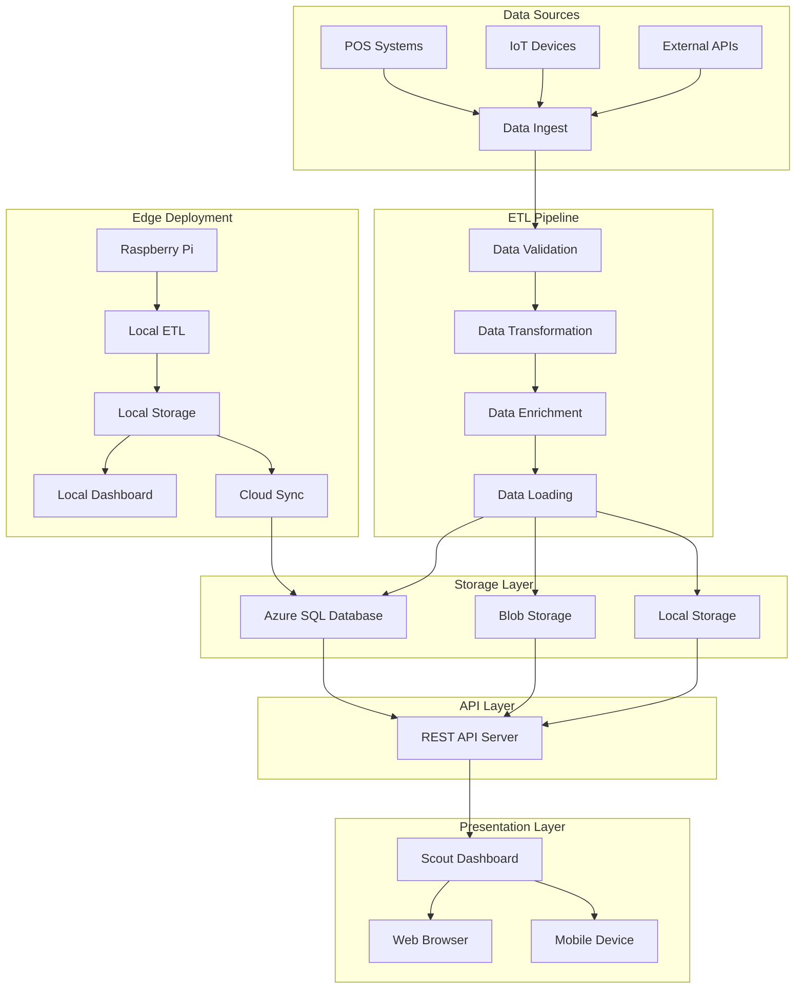

# 🚀 Scout Dashboard v1.0 - Production Release Plan

## 📋 Release Objectives

Transform the Scout Dashboard into a professional, whitelabel, production-ready analytics platform with:

1. **Clean Architecture**: Modular, maintainable codebase
2. **Complete ETL Pipeline**: Full data ingestion to visualization flow
3. **Edge/Pi Deployment**: Support for edge computing scenarios
4. **Professional Documentation**: Enterprise-grade documentation and diagrams
5. **Whitelabel Ready**: Client-safe, brandable implementation

---

## 🏗️ New Project Structure

```
project-scout-v1/
├── README.md                    # Professional project overview
├── LICENSE                      # Open source license
├── .gitignore                   # Clean exclusions
├── package.json                 # Dependencies and scripts
├── deploy/                      # Production-ready dashboard
│   ├── index.html              # Main dashboard interface
│   ├── js/                     # Client-side modules
│   ├── css/                    # Styling and themes
│   ├── data/                   # Sample/static data
│   └── assets/                 # Images, icons, fonts
├── etl/                        # Complete ETL pipeline
│   ├── ingest/                 # Data ingestion modules
│   ├── transform/              # Data transformation logic
│   ├── load/                   # Data loading and storage
│   ├── config/                 # Pipeline configuration
│   ├── tests/                  # ETL testing suite
│   └── run_pipeline.py         # Main pipeline orchestrator
├── docs/                       # Comprehensive documentation
│   ├── architecture.md         # System architecture overview
│   ├── api_reference.md        # API documentation
│   ├── deployment_guide.md     # Deployment instructions
│   ├── edge_pi_deploy.md       # Edge/Pi specific guide
│   ├── troubleshooting.md      # Common issues and solutions
│   └── images/                 # Diagrams and screenshots
├── src/                        # Source code (if needed)
│   ├── api/                    # API server code
│   ├── utils/                  # Utility functions
│   └── config/                 # Application configuration
└── scripts/                    # Deployment and utility scripts
    ├── deploy.sh               # One-click deployment
    ├── setup_edge.sh           # Edge device setup
    └── test_pipeline.sh        # ETL testing script
```

---

## 🔄 ETL Pipeline Architecture

### **Data Flow**
1. **Ingest**: Collect data from multiple sources (APIs, files, devices)
2. **Transform**: Clean, validate, enrich, and structure data
3. **Load**: Store in Azure SQL, Data Lake, or local storage
4. **Serve**: Expose via REST APIs for dashboard consumption

### **Components**
- **Data Connectors**: REST APIs, file readers, device interfaces
- **Transformation Engine**: Data cleaning, validation, enrichment
- **Storage Layer**: Azure SQL, Blob Storage, local databases
- **API Layer**: RESTful endpoints for dashboard consumption
- **Monitoring**: Health checks, error handling, logging

---

## 📊 Architecture Diagram



---

## 🎯 v1.0 Features

### **Core Analytics**
- ✅ Transaction Trends Analysis
- ✅ Geographic Heatmap Visualization
- ✅ Product Mix & SKU Analysis
- ✅ Consumer Behavior Insights
- ✅ Customer Profiling & Segmentation

### **ETL Pipeline**
- ✅ Modular data ingestion framework
- ✅ Configurable transformation engine
- ✅ Multiple storage backend support
- ✅ Real-time and batch processing
- ✅ Error handling and recovery

### **Deployment Options**
- ✅ Cloud deployment (Azure, AWS, GCP)
- ✅ Static site hosting (Vercel, Netlify)
- ✅ Edge computing (Raspberry Pi, IoT)
- ✅ On-premise installation
- ✅ Container deployment (Docker)

### **Professional Features**
- ✅ Comprehensive documentation
- ✅ Automated testing suite
- ✅ Deployment automation
- ✅ Monitoring and logging
- ✅ Security best practices

---

## 📅 Release Timeline

| Phase | Duration | Deliverables |
|-------|----------|--------------|
| **Setup** | 1-2 hours | Project structure, initial files |
| **ETL Implementation** | 2-3 hours | Complete pipeline with tests |
| **Documentation** | 1-2 hours | All docs, diagrams, guides |
| **Testing & QA** | 1 hour | Validation, UAT, testing |
| **Release** | 30 minutes | Tag, publish, announce |

**Total Estimated Time**: 5-8 hours for complete v1.0 release

---

## 🎯 Success Criteria

- [ ] Clean, professional codebase with no internal references
- [ ] Complete ETL pipeline with documented API
- [ ] Comprehensive documentation with architecture diagrams
- [ ] Edge/Pi deployment capability
- [ ] Automated testing and deployment
- [ ] Client-ready whitelabel implementation
- [ ] GitHub release with all assets

---

## 📦 Deliverables

1. **Production Dashboard**: Clean, optimized web application
2. **ETL Pipeline**: Complete data processing system
3. **Documentation Suite**: Professional docs with diagrams
4. **Deployment Scripts**: One-click deployment automation
5. **Edge/Pi Guide**: Complete edge deployment instructions
6. **GitHub Release**: Tagged v1.0 with all assets

---

**This release plan transforms the Scout Dashboard from a proof-of-concept into a production-ready, enterprise-grade analytics platform suitable for client delivery or open-source publication.**