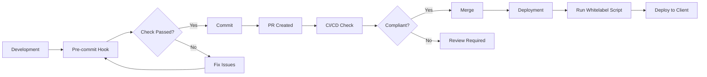

# Whitelabeling Guide for Client360 Dashboard

## Overview

This guide provides comprehensive instructions for removing all internal branding, AI assistant signatures, and proprietary references before deploying to clients. The whitelabeling system ensures a clean, professional deployment free from internal implementation details.

## Quick Start

```bash
# Apply whitelabeling to a deployment directory
./whitelabel_deploy.sh <deployment_directory>

# Example:
./whitelabel_deploy.sh final-locked-dashboard/scout_dlt_pipeline/client360_dashboard/deploy
```

## What Gets Removed/Replaced

### 1. Internal Branding Terms

| Original Term | Replacement |
|--------------|-------------|
| InsightPulseAI | Client360 |
| InsightPulse AI | Client360 |
| Pulser | System |
| TBWA | Client |
| Scout Dashboard | Analytics Dashboard |
| Project Scout | Analytics Platform |

### 2. Internal Agent Names

| Original Name | Replacement |
|--------------|-------------|
| Claudia | Assistant |
| Maya | Process Manager |
| Kalaw | Data Manager |
| Tide | Analytics Engine |
| Caca | QA System |
| Basher | Automation Tool |
| Surf | Development Tool |

### 3. AI Assistant Signatures

The system removes signatures from:
- Claude / Claude Code
- GitHub Copilot
- Cline
- Cursor
- Windsurf
- ChatGPT
- Codeium
- Tabnine
- Generic AI-generated markers

### 4. Internal Files and Directories

Files that are automatically removed:
- `CLAUDE.md`
- `.pulserrc`
- `pulser.config.yaml`
- `agents/` directory
- `pulser/` directory
- `InsightPulseAI*` files
- `.env.development` and `.env.local`
- `*_INTERNAL.md` files
- `internal_docs/` directory
- `proprietary/` directory

## Automated Enforcement

### Pre-commit Hook

Install the pre-commit hook to check files before committing:

```bash
# Set up git to use our hooks directory
git config core.hooksPath .githooks

# Or manually copy the hook
cp .githooks/pre-commit .git/hooks/pre-commit
chmod +x .git/hooks/pre-commit
```

### CI/CD Integration

The repository includes a GitHub Actions workflow (`.github/workflows/whitelabel-check.yml`) that:
- Runs on all PRs to main branches
- Checks for internal branding terms
- Scans for AI signatures
- Verifies no internal files are present
- Generates compliance reports

## Manual Whitelabeling Process

If you need to manually whitelabel specific files:

### 1. Remove AI Signatures

```bash
# Scan and remove AI signatures from a directory
./remove_ai_signatures.sh <directory>
```

### 2. Replace Branding Terms

Use your text editor's find/replace with the mappings above, or:

```bash
# Example using sed
sed -i 's/InsightPulseAI/Client360/g' file.js
sed -i 's/TBWA/Client/g' file.js
```

### 3. Clean Configuration Files

Remove or sanitize:
- Repository URLs in `package.json`
- Author information
- Internal documentation references
- Development-specific configurations

## Verification

After whitelabeling, verify the results:

```bash
# Check for remaining internal terms
grep -r "InsightPulse\|Pulser\|TBWA\|Claudia" <directory>

# Check for AI signatures
grep -r "Generated with\|Co-Authored-By\|AI-generated" <directory>

# Review the generated audit report
cat ai_signature_audit_*.txt
```

## Deployment After Whitelabeling

Once whitelabeled, deploy using:

```bash
# Azure Static Web Apps
az staticwebapp deploy \
  --name <app-name> \
  --source <whitelabeled-directory>

# Or use the deployment package
# A .zip file is automatically created after whitelabeling
```

## Best Practices

1. **Always whitelabel before client deployments** - Make it part of your deployment checklist
2. **Test after whitelabeling** - Ensure functionality isn't affected by replacements
3. **Review the audit report** - Check what was removed/replaced
4. **Keep backups** - The script automatically creates backups with timestamps
5. **Use generic terms in new code** - Avoid hardcoding internal names

## Troubleshooting

### Common Issues

1. **"Permission denied" errors**
   ```bash
   chmod +x whitelabel_deploy.sh
   chmod +x remove_ai_signatures.sh
   ```

2. **Missed replacements**
   - Check file extensions are included in the script
   - Verify the file isn't in an excluded directory
   - Some terms might be in unexpected formats (e.g., camelCase)

3. **Functionality breaks after whitelabeling**
   - Review the backup to identify critical replacements
   - Some API endpoints or configuration keys might need exclusion
   - Add exceptions to the script for technical requirements

### Adding Exceptions

If certain terms must be preserved for technical reasons:

1. Edit `whitelabel_deploy.sh`
2. Add exclusion logic in the replacement loop
3. Document why the exception is necessary

## Maintenance

### Adding New Terms

To add new internal terms to be replaced:

1. Edit `whitelabel_deploy.sh`
2. Add to the `SEARCH_TERMS` and `REPLACE_TERMS` arrays
3. Update `.githooks/pre-commit` with the new terms
4. Update `.github/workflows/whitelabel-check.yml`

### Updating AI Signatures

To add new AI tool signatures:

1. Edit `remove_ai_signatures.sh`
2. Add to the `AI_NAMES` and `AI_PATTERNS` arrays
3. Test the pattern with grep first

## Integration with Development Workflow



## Support

For questions or issues with whitelabeling:
1. Check this guide first
2. Review the script outputs and logs
3. Check the generated audit reports
4. Contact the development team if needed

Remember: Whitelabeling is crucial for maintaining professional client relationships and protecting proprietary information.