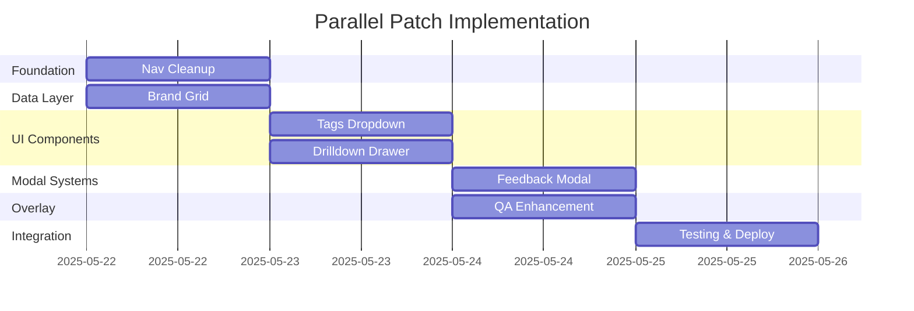

# 🔄 Parallel Patch Implementation Playbook

## 📋 Feature Branches & Dependencies

| Order | Patch | Branch Name | Status | Dependencies |
|-------|-------|-------------|--------|--------------|
| 1 | Nav cleanup & config.js consolidation | `feature/cleanup-nav` | 🟡 In Progress | None |
| 2 | Brand grid → real data endpoint wiring | `feature/brand-grid-realdata` | ⏳ Pending | cleanup-nav |
| 3 | Tags dropdown | `feature/tags-dropdown` | ⏳ Pending | cleanup-nav |
| 4 | Drill-down drawer UI | `feature/drilldown-drawer-ui` | ⏳ Pending | cleanup-nav, brand-grid |
| 5 | Feedback/UAT modal | `feature/feedback-modal` | ⏳ Pending | None (isolated) |
| 6 | QA-Overlay toggle | `feature/qa-overlay` | ⏳ Pending | All others (wraps) |

## 🛡️ Isolation Strategy

### Component Namespacing
```javascript
window.Client360 = window.Client360 || {};
window.Client360.NavCleanup = {};
window.Client360.BrandGrid = {};
window.Client360.TagsDropdown = {};
window.Client360.DrilldownDrawer = {};
window.Client360.FeedbackModal = {};
window.Client360.QAOverlay = {};
```

### CSS Scoping
```css
.nav-cleanup { /* Patch 1 styles */ }
.brand-grid { /* Patch 2 styles */ }
.tags-dropdown { /* Patch 3 styles */ }
.drilldown-drawer { /* Patch 4 styles */ }
.feedback-modal { /* Patch 5 styles */ }
.qa-overlay-enhanced { /* Patch 6 styles */ }
```

### Component Folders
```
js/components/
├── nav-cleanup/
│   ├── nav-manager.js
│   ├── config-consolidator.js
│   └── styles.css
├── brand-grid/
│   ├── brand-grid.js
│   ├── data-connector.js
│   └── styles.css
├── tags-dropdown/
│   ├── tags-dropdown.js
│   ├── tag-manager.js
│   └── styles.css
├── drilldown-drawer/
│   ├── drawer-ui.js
│   ├── drawer-content.js
│   └── styles.css
├── feedback-modal-enhanced/
│   ├── modal-manager.js
│   ├── feedback-collector.js
│   └── styles.css
└── qa-overlay-enhanced/
    ├── qa-manager.js
    ├── diagnostic-tools.js
    └── styles.css
```

## 🔄 Merge Order & Testing

### Phase 1: Foundation (Patch 1)
```bash
git checkout -b feature/cleanup-nav
# Implement nav cleanup
git merge feature/cleanup-nav
npm run test:smoke
```

### Phase 2: Data Layer (Patch 2)
```bash
git checkout -b feature/brand-grid-realdata
# Implement brand data wiring
git merge feature/brand-grid-realdata
npm run test:integration
```

### Phase 3: UI Components (Patches 3-4)
```bash
git checkout -b feature/tags-dropdown
git checkout -b feature/drilldown-drawer-ui
# Implement in parallel, merge sequentially
npm run test:ui
```

### Phase 4: Modal Systems (Patch 5)
```bash
git checkout -b feature/feedback-modal
# Implement modal enhancements
npm run test:modals
```

### Phase 5: Overlay System (Patch 6)
```bash
git checkout -b feature/qa-overlay
# Implement enhanced QA overlay
npm run test:complete
```

## 🧪 Testing Strategy

### Smoke Tests After Each Merge
```javascript
// smoke-tests.js
const smokeTests = [
  'nav-clickability',
  'brand-names-display',
  'tags-functionality', 
  'drawer-opens',
  'modal-triggers',
  'overlay-toggles'
];
```

### Integration Tests
```javascript
// integration-tests.js  
const integrationTests = [
  'nav-to-brand-grid',
  'tags-filter-brand-grid',
  'brand-grid-to-drawer',
  'drawer-to-feedback',
  'qa-overlay-all-components'
];
```

## 🚀 CI/CD Pipeline

### Branch Protection
```yaml
# .github/branch-protection.yml
branches:
  - main
  - feature/*
required_checks:
  - smoke-tests
  - integration-tests
  - build-success
```

### Parallel Testing
```yaml
# .github/workflows/parallel-patches.yml
strategy:
  matrix:
    patch: [nav-cleanup, brand-grid, tags-dropdown, drilldown-drawer, feedback-modal, qa-overlay]
runs-on: ubuntu-latest
```

## 📊 Conflict Prevention Matrix

| Component | Shared Files | Conflict Risk | Mitigation |
|-----------|--------------|---------------|------------|
| Nav Cleanup | dashboard.js, index.html | 🟡 Medium | Isolated nav container |
| Brand Grid | dashboard.js | 🟢 Low | Separate component namespace |
| Tags Dropdown | global-filters.js | 🟡 Medium | Extend existing filter system |
| Drilldown Drawer | dashboard.js, CSS | 🟡 Medium | Modal overlay approach |
| Feedback Modal | Existing feedback system | 🟢 Low | Enhancement, not replacement |
| QA Overlay | Global event listeners | 🔴 High | Last to merge, careful testing |

## ⚡ Implementation Timeline



---

*This playbook ensures conflict-free parallel development while maintaining code quality and system integrity.*