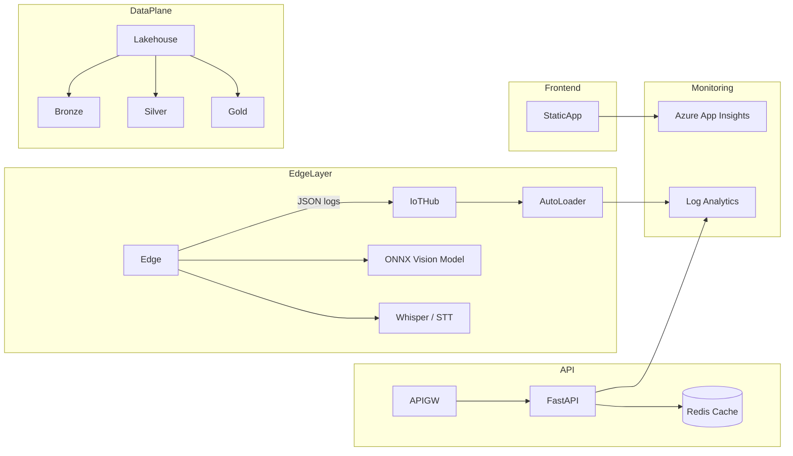
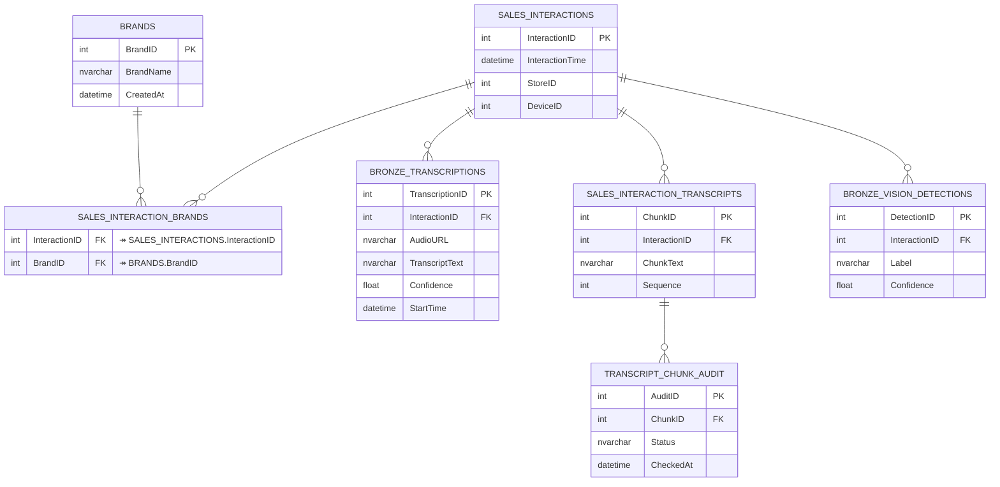
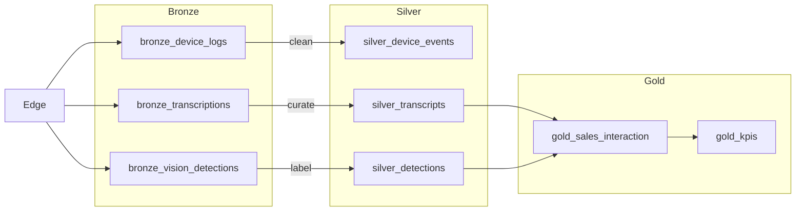

# Client360 Dashboard Documentation

## Overview

Client360 Dashboard provides comprehensive analytics and insights for retail store performance, customer interactions, and brand visibility. This dashboard is designed for TBWA clients to monitor real-time store metrics, analyze sales data, and visualize geographical performance trends.

## Key Features

- **KPI Monitoring**: Track key performance indicators in real-time
- **Geospatial Analysis**: Visualize store performance on interactive maps
- **Data Source Flexibility**: Toggle between live and sample data
- **Theme Support**: TBWA and SariSari theme configurations
- **Rollback System**: Safely revert to previous dashboard versions
- **SQL Connector**: Direct connection to data sources

## Getting Started

### Prerequisites

- Modern web browser (Chrome, Firefox, Edge, Safari)
- Access credentials for the dashboard
- Network connectivity to TBWA Azure services

### Accessing the Dashboard

The dashboard is accessible at:
- Production: [https://blue-coast-0acb6880f.azurestaticapps.net](https://blue-coast-0acb6880f.azurestaticapps.net)
- QA/Staging: [https://blue-coast-0acb6880f-qa.azurestaticapps.net](https://blue-coast-0acb6880f-qa.azurestaticapps.net)

## Architecture Diagrams

### Context Diagram

```mermaid
%% include docs/architecture/context.mmd
flowchart TD
    User([Client Exec / Ops]) --> Browser[Web Browser]
    Browser --> StaticApp[Azure Static Web App ("Client 360")]
    StaticApp -->|REST / GraphQL| APIGW[Azure API Management]
    APIGW --> FastAPI[Analytics API (FastAPI + Auth)]

    Edge[Edge Devices (Pi 5)] -->|JSON events| IoTHub[Azure IoT Hub / Event Hubs]
    IoTHub --> AutoLoader[Databricks Autoloader (Structured Streaming)]
    AutoLoader --> Lakehouse[(Delta Lakehouse)]
    Lakehouse --> FastAPI
    FastAPI --> APIGW
```

### High-Level Design (HLD)



### Entity–Relationship Diagram (ERD)



### Medallion Flow



## Deployment Pipeline

The Client360 Dashboard uses a sophisticated CI/CD pipeline with the following features:

- Environment isolation (Dev, QA, Production)
- Automated testing at multiple levels
- Blue-Green deployment for zero downtime
- Comprehensive smoke and QA tests
- Automated rollback capabilities
- Standard deployment via `feature-dashboard` branch

The `feature-dashboard` branch serves as the primary mirror/deploy source for all CI/CD operations. This ensures consistency across environments and simplifies the deployment workflow.

For more details about the deployment process, see [DEPLOYMENT_PIPELINE.md](../DEPLOYMENT_PIPELINE.md).

## User Guide

### Dashboard Navigation

The dashboard is organized into several key sections:

1. **KPI Overview**: Summary of key performance metrics
2. **Geographical Analysis**: Store performance on interactive maps
3. **Brand Performance**: Brand-specific metrics and trends
4. **Sales Analytics**: Detailed sales data and projections

### Theme Selection

The dashboard supports multiple themes:

- **TBWA**: Corporate theme with navy blue and cyan accents
- **SariSari**: Retail-focused theme with vibrant colors

### Using the Rollback Feature

The rollback component allows authorized users to revert to previous dashboard versions:

1. Locate the rollback component at the top of the dashboard
2. Click "Verify Current State" to check system health
3. If needed, click "Rollback System" to revert to the previous stable version

## SQL Data Connection

The dashboard can connect to various data sources:

- Direct SQL connection to Azure SQL
- Sample data for demonstration purposes
- Toggle between data sources using the data source toggle

## Troubleshooting

Common issues and solutions:

1. **Dashboard not loading**: Check network connectivity and clear browser cache
2. **Data not refreshing**: Verify the data source toggle setting
3. **Map not displaying**: Ensure geospatial data access is enabled

## Support

For technical support, contact:
- Email: support@tbwa.com
- Internal ticketing system: [TBWA Help Desk](https://help.tbwa.com)