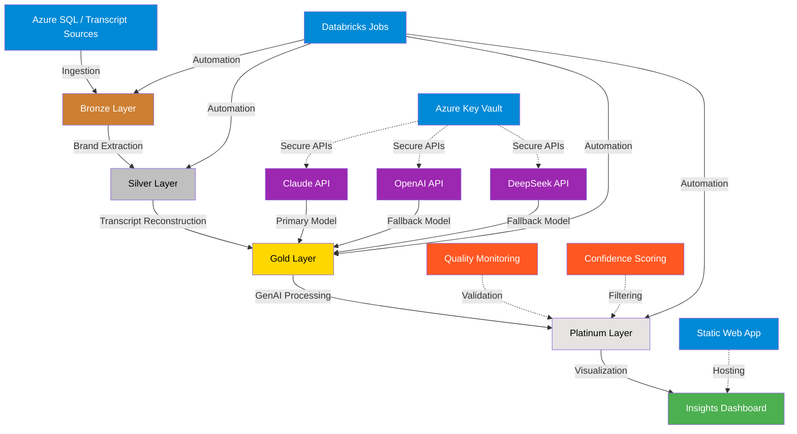

# Juicer GenAI Insights: Architecture Diagram

## Key Components

### Data Layers
- **Bronze Layer**: Raw transcript data
- **Silver Layer**: Brand mentions with sentiment
- **Gold Layer**: Reconstructed transcripts
- **Platinum Layer**: GenAI insights

### Azure Resources
- **Databricks Workspace**: Data processing
- **Storage Account**: Data lake storage
- **Key Vault**: Secure credentials
- **Static Web App**: Dashboard hosting

### GenAI Processing
- **Multi-model approach**: Claude, OpenAI, DeepSeek
- **Automatic fallback**: For model resilience
- **Confidence scoring**: Quality validation

### Integration
- **Pulser CLI**: Command-line access
- **GitHub Actions**: CI/CD automation
- **Scheduled Jobs**: Regular processing