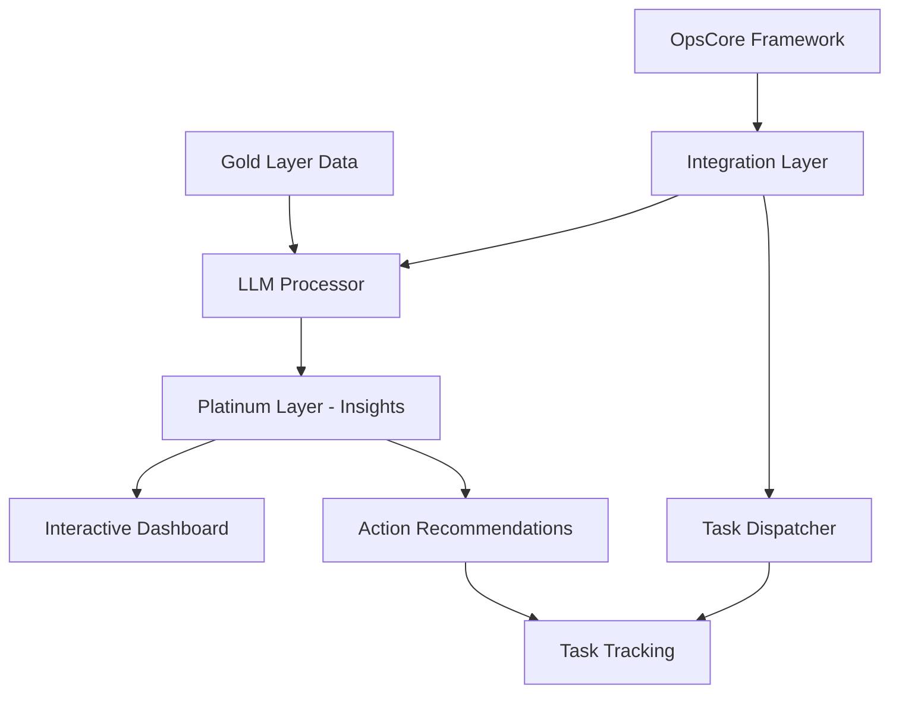

# 📟 Project Scout SDK – GenAI Insights Module

This module adds automated insights generation to the Project Scout SDK, enabling AI-powered business intelligence from customer interactions, powered by the OpsCore agent framework.

---

## 📁 Module Components

```
retail-advisor/
🔽 dashboards/          # Interactive HTML dashboards
  🔽 retail_advisor_insights.html
  🔽 insights_visualizer.js
🔽 notebooks/           # Databricks notebooks
  🔽 retail_advisor_gold_insights.py
  🔽 retail_advisor_setup_insights_tables.sql
🔽 config/              # OpsCore integration config
  🔽 opscore-config.yaml
  🔽 retail-advisor-hook.yaml
🔽 docs/                # Implementation documentation
  🔽 GenAI_Retail_Advisor.md
🔽 README.md
🔽 LICENSE.txt
🔽 NOTICE.md
```

---

## ⚙️ Architecture Overview



---

## 🔄 Insights Generation Flow

The Retail Advisor Insights module processes data through this flow:

1. **Data Selection**: Pulls Gold-layer data (cleaned customer interaction transcripts)
2. **LLM Processing**: Analyzes data using advanced AI models 
3. **Insight Generation**: Creates structured insights with confidence scoring
4. **Dashboard Rendering**: Visualizes insights in interactive UI
5. **Action Tracking**: Monitors business actions taken based on insights

---

## 📊 Insight Types

The module generates four types of insights:

### 1. 🔹 **General Insights**

* Customer behavior patterns
* Emerging market trends
* Cross-product opportunities

### 2. 🔸 **Brand Insights**

* Competitive positioning
* Brand perception comparison
* Reference context (positive/negative)

### 3. 🔷 **Sentiment Insights**

* Sentiment drivers by product/feature
* Emotional response patterns
* Satisfaction trend analysis

### 4. 🔶 **Trend Insights**

* Emerging topics over time
* Velocity of change in preferences
* Early indicators of market shifts

---

## 📈 Dashboard Features

The Retail Advisor Insights Dashboard provides:

* Filterable insights by brand, type, confidence, and time period
* Interactive charts showing brand sentiment and mention frequency
* Trending tags visualization
* Confidence-scored insight cards with recommended actions
* Exportable data for further analysis

---

## 🚀 Getting Started

1. Install the OpsCore CLI:
   ```bash
   ./install_opscore.sh
   ```

2. Configure Retail Advisor integration:
   ```bash
   opscore config --set retail_advisor=true
   ```

3. Run your first insight generation:
   ```bash
   :retail-advisor insights generate --days 7
   ```

4. View the dashboard:
   ```bash
   :retail-advisor dashboard insights
   ```

---

## 📤 Integration with Databricks

Upload the notebooks to your Databricks workspace:

```bash
databricks workspace import retail-advisor/notebooks/retail_advisor_gold_insights.py /retail-advisor/gold_insights -l PYTHON -o
databricks workspace import retail-advisor/notebooks/retail_advisor_setup_insights_tables.sql /retail-advisor/setup_insights_tables -l SQL -o
```

Schedule jobs for automated insight generation:

```bash
databricks jobs create --json-file retail-advisor/config/retail_advisor_jobs.json
```

---

## 📊 Azure WAF Integration

This module aligns with the Azure Well-Architected Framework (WAF). Metrics across five pillars are available in the System Health dashboard:

| WAF Pillar        | Dashboard Metric Examples                             |
| ----------------- | ----------------------------------------------------- |
| Reliability       | Insight generation success rate, data freshness        |
| Performance       | LLM processing time, dashboard rendering performance   |
| Operational Ex.   | Insight tracking, insight-to-action conversion         |
| Security          | Data access controls, sensitive information handling   |
| Cost Optimization | LLM token usage, batch vs. real-time processing costs  |

---

## ❓ Contact / Support

For implementation support or questions about the Retail Advisor insights module, please contact:

Project Scout Implementation Team
[contact@projectscout.example.com]

> © Project Scout, deployed for TBWA. All components follow the license terms specified in LICENSE.txt and NOTICE.md.