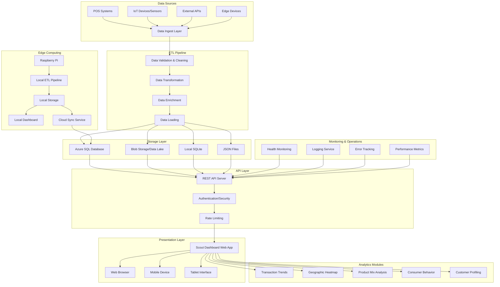

# 🏗️ Scout Dashboard - System Architecture

## Overview

The Scout Dashboard is a production-ready analytics platform designed for retail intelligence, featuring a complete ETL pipeline, real-time data processing, and flexible deployment options including edge computing support.

## Architecture Diagram



## System Components

### 1. Data Ingestion Layer

The data ingestion layer handles multiple data sources with fault tolerance and retry mechanisms:

- **POS Systems**: Real-time transaction data from retail point-of-sale systems
- **IoT Devices**: Sensor data from smart shelves, cameras, and environmental monitors
- **External APIs**: Third-party data sources, market data, weather information
- **Edge Devices**: Local data collection from Raspberry Pi and edge computing nodes

**Key Features:**
- Configurable data source connectors
- Automatic retry with exponential backoff
- Data validation at ingestion point
- Support for batch and real-time streaming

### 2. ETL Pipeline

The ETL (Extract, Transform, Load) pipeline processes raw data into analytics-ready formats:

#### Extract Phase
- Collects data from configured sources
- Handles multiple data formats (JSON, CSV, XML, databases)
- Implements connection pooling and rate limiting
- Provides data source health monitoring

#### Transform Phase
- **Data Cleaning**: Removes duplicates, handles null values, corrects data types
- **Data Validation**: Schema validation, business rule enforcement, outlier detection
- **Data Enrichment**: Adds calculated fields, geographic lookups, category mappings
- **Data Aggregation**: Creates daily, weekly, and monthly summaries

#### Load Phase
- Supports multiple storage backends (Azure SQL, SQLite, JSON files, CSV)
- Implements upsert logic for incremental updates
- Creates optimized indexes for query performance
- Provides data versioning and audit trails

### 3. Storage Layer

Multi-tier storage architecture for scalability and performance:

#### Cloud Storage (Production)
- **Azure SQL Database**: Structured data for complex queries and transactions
- **Azure Blob Storage**: Large datasets, historical data, and data lake functionality
- **Cosmos DB**: Document storage for flexible schema requirements

#### Local Storage (Development/Edge)
- **SQLite**: Lightweight relational database for local development and edge deployment
- **JSON Files**: Direct file-based storage for static dashboard data
- **CSV Files**: Export format for data analysis and reporting

### 4. API Layer

RESTful API layer providing secure data access:

#### Endpoints
- `/api/transactions` - Transaction data and trends
- `/api/geographic` - Location-based analytics
- `/api/products` - Product and SKU analysis
- `/api/behavior` - Consumer behavior insights
- `/api/customers` - Customer profiling data
- `/api/health` - System health and monitoring

#### Security Features
- JWT-based authentication
- Role-based access control (RBAC)
- API rate limiting and throttling
- Request/response logging
- CORS configuration for cross-origin access

### 5. Dashboard Application

Modern web application built with responsive design:

#### Analytics Modules
1. **Transaction Trends**: Time-series analysis of sales patterns
2. **Geographic Heatmap**: Location-based performance visualization
3. **Product Mix Analysis**: SKU and category performance metrics
4. **Consumer Behavior**: Shopping pattern analysis and insights
5. **Customer Profiling**: Demographic segmentation and targeting

#### Technical Features
- Mobile-responsive design
- Real-time data updates
- Interactive visualizations
- Offline capability for edge deployments
- Progressive Web App (PWA) support

### 6. Edge Computing Support

Distributed deployment capability for edge scenarios:

#### Edge Components
- **Local ETL Pipeline**: Reduced-footprint data processing
- **Local Storage**: SQLite database for edge data
- **Local Dashboard**: Standalone dashboard interface
- **Cloud Sync**: Periodic synchronization with central systems

#### Use Cases
- Retail stores with limited connectivity
- Remote locations with local processing needs
- Data sovereignty and privacy requirements
- Reduced latency for real-time decisions

## Data Flow

### 1. Real-time Processing
```
Data Source → Ingestion → Validation → Transform → Load → API → Dashboard
```

### 2. Batch Processing
```
Scheduled Job → Bulk Extract → Transform → Aggregate → Load → Cache → API
```

### 3. Edge Synchronization
```
Edge Device → Local Process → Local Store → Sync Service → Cloud Storage
```

## Deployment Architectures

### Cloud Deployment
- **Azure Static Web Apps**: Frontend hosting with global CDN
- **Azure Functions**: Serverless API backend
- **Azure SQL Database**: Managed database service
- **Azure Blob Storage**: Object storage for large datasets

### Hybrid Deployment
- **Cloud Backend**: Central data processing and storage
- **Edge Frontend**: Local dashboard deployment
- **Sync Services**: Bi-directional data synchronization

### On-Premise Deployment
- **Local Servers**: Self-hosted application stack
- **Local Database**: On-premise SQL Server or PostgreSQL
- **Local Storage**: Network-attached storage (NAS) for files

### Edge Deployment
- **Raspberry Pi**: Complete stack on edge hardware
- **Local Processing**: All analytics computed locally
- **Optional Sync**: Periodic cloud synchronization

## Security Architecture

### Data Security
- Encryption in transit (TLS 1.3)
- Encryption at rest (AES-256)
- Data masking for sensitive information
- Audit logging for all data access

### Application Security
- Authentication via JWT tokens
- Authorization with role-based permissions
- Input validation and sanitization
- SQL injection protection
- XSS prevention

### Infrastructure Security
- Network segmentation
- Firewall configuration
- Regular security updates
- Vulnerability scanning
- Backup and disaster recovery

## Performance Considerations

### Scalability
- Horizontal scaling for API layer
- Database connection pooling
- Caching strategies (Redis/MemoryCache)
- Load balancing for high availability

### Optimization
- Database index optimization
- Query performance tuning
- Compression for data transfer
- CDN for static assets
- Progressive loading for large datasets

## Monitoring and Operations

### Health Monitoring
- Application health checks
- Database connectivity monitoring
- API response time tracking
- Error rate monitoring

### Logging and Alerting
- Structured logging (JSON format)
- Centralized log aggregation
- Real-time alerting for critical issues
- Performance metrics collection

### Backup and Recovery
- Automated database backups
- Point-in-time recovery
- Disaster recovery procedures
- Data retention policies

## Technology Stack

### Backend
- **Python 3.8+**: ETL pipeline and data processing
- **Node.js**: API server and middleware
- **Express.js**: Web framework for REST APIs
- **SQLAlchemy**: Database ORM for Python
- **Pandas**: Data manipulation and analysis

### Frontend
- **HTML5/CSS3**: Modern web standards
- **JavaScript (ES6+)**: Client-side functionality
- **Chart.js**: Data visualization library
- **Bootstrap**: Responsive UI framework

### Database
- **Azure SQL Database**: Cloud database service
- **SQLite**: Local and edge deployment
- **Azure Blob Storage**: Object storage

### DevOps
- **Docker**: Containerization
- **GitHub Actions**: CI/CD pipeline
- **Azure DevOps**: Project management and deployment
- **Terraform**: Infrastructure as Code

This architecture provides a robust, scalable, and secure foundation for the Scout Dashboard, supporting deployment scenarios from edge devices to enterprise cloud environments.