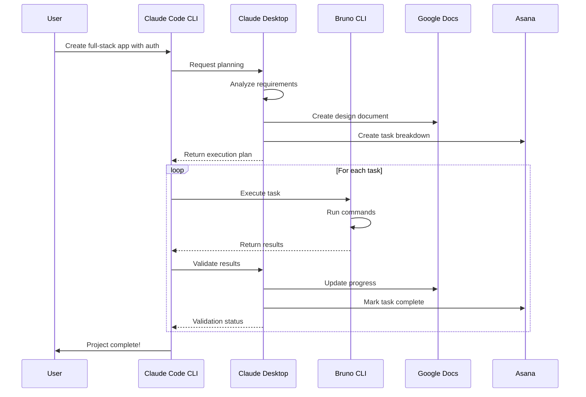

# Master Orchestrator Architecture: Claude Code CLI + Claude Desktop + Bruno

## Architectural Overview

```
┌─────────────────────────────────────────────────────────────────────────┐
│                         CLAUDE CODE CLI                                 │
│                      (MASTER ORCHESTRATOR)                              │
├─────────────────────────────────────────────────────────────────────────┤
│  • Central command and control                                          │
│  • Workflow orchestration across tools                                  │
│  • Context management and state tracking                                │
│  • Integration hub for all services                                     │
│  • User interaction layer                                               │
└────────────────────────────┬────────────────────────────────────────────┘
                             │
        ┌────────────────────┴────────────────────┐
        │                                         │
        ▼                                         ▼
┌───────────────────────┐              ┌──────────────────────────┐
│   CLAUDE DESKTOP      │              │       BRUNO CLI          │
│ (PLANNER & CHECKER)   │◀────────────▶│     (EXECUTOR)           │
├───────────────────────┤              ├──────────────────────────┤
│ • Task planning       │              │ • Local execution        │
│ • Validation          │              │ • Sandboxed operations   │
│ • Quality assurance   │              │ • Tool integration       │
│ • Progress monitoring │              │ • Script running         │
│ • Error analysis      │              │ • File operations        │
└───────────┬───────────┘              └───────────┬──────────────┘
            │                                       │
            │      ┌────────────────────┐          │
            └─────▶│  GOOGLE DOCS &     │◀─────────┘
                   │  ASANA INTEGRATION │
                   ├────────────────────┤
                   │ • Documentation    │
                   │ • Task tracking    │
                   │ • Collaboration    │
                   │ • Progress reports │
                   └────────────────────┘
```

## Detailed Role Definitions

### 1. CLAUDE CODE CLI - Master Orchestrator

```yaml
Role: Master Orchestrator
Purpose: Central control point for entire workflow

Responsibilities:
  Workflow Management:
    - Receive user requests
    - Decompose complex tasks
    - Delegate to appropriate tools
    - Maintain execution context
    - Coordinate between services
    
  Integration Hub:
    - Connect to Claude Desktop for planning
    - Dispatch tasks to Bruno for execution
    - Update Google Docs with progress
    - Sync with Asana for task tracking
    - Aggregate results from all sources
    
  State Management:
    - Track overall project state
    - Maintain conversation context
    - Store intermediate results
    - Handle cross-tool dependencies
    - Manage rollback scenarios
    
  User Interface:
    - Natural language understanding
    - Multi-line input handling
    - Real-time progress updates
    - Error reporting and recovery
    - Result presentation
```

### 2. CLAUDE DESKTOP - Planner & Checker

```yaml
Role: Planner and Checker
Purpose: Strategic planning and quality validation

Responsibilities:
  Planning:
    - Analyze requirements
    - Create detailed task plans
    - Define success criteria
    - Identify dependencies
    - Suggest optimal approaches
    
  Validation:
    - Review execution results
    - Check quality standards
    - Verify completeness
    - Validate against requirements
    - Approve for next steps
    
  Documentation:
    - Generate planning documents
    - Create validation reports
    - Update project documentation
    - Maintain decision logs
    - Track changes and rationale
    
  Analysis:
    - Code review and analysis
    - Architecture validation
    - Security checking
    - Performance assessment
    - Best practice compliance
```

### 3. BRUNO CLI - Executor

```yaml
Role: Executor
Purpose: Secure local execution of tasks

Responsibilities:
  Execution:
    - Run shell commands
    - Execute scripts
    - Perform file operations
    - Handle tool integration
    - Manage local resources
    
  Security:
    - Sandboxed environment
    - Permission management
    - Resource isolation
    - Safe execution
    - Privacy protection
    
  Integration:
    - Google Docs API access
    - Asana API integration
    - Local tool coordination
    - File system operations
    - Database connections
    
  Reporting:
    - Execution status
    - Error details
    - Performance metrics
    - Resource usage
    - Success/failure states
```

## Workflow Examples

### Example 1: Creating a Full-Stack Application with Documentation



### Example 2: Complex Deployment with Validation

```
User Input: "Deploy my app to production with full testing"

CLAUDE CODE CLI (Orchestrator):
├─> Receives request
├─> Initiates workflow
└─> Coordinates execution

    CLAUDE DESKTOP (Planner):
    ├─> Creates deployment plan
    ├─> Defines test criteria
    ├─> Documents in Google Docs:
    │   - Deployment checklist
    │   - Test requirements
    │   - Rollback procedures
    └─> Creates Asana tasks:
        - Run unit tests
        - Run integration tests
        - Build application
        - Deploy to staging
        - Run smoke tests
        - Deploy to production
        - Verify deployment

    BRUNO CLI (Executor):
    ├─> Executes test suite
    │   └─> npm test
    ├─> Builds application
    │   └─> npm run build
    ├─> Deploys to staging
    │   └─> vercel deploy --env=staging
    ├─> Runs smoke tests
    │   └─> npm run test:e2e
    └─> Deploys to production
        └─> vercel deploy --prod

    CLAUDE DESKTOP (Checker):
    ├─> Validates test results
    ├─> Checks deployment status
    ├─> Updates documentation
    └─> Marks tasks complete

CLAUDE CODE CLI (Orchestrator):
└─> Reports success to user
```

## Integration Workflows

### Google Docs Integration Flow

```yaml
Claude Code CLI (Orchestrates):
  1. Identifies documentation needs
  2. Requests Claude Desktop to plan structure
  
Claude Desktop (Plans):
  1. Creates document outline
  2. Defines sections and content
  
Bruno CLI (Executes):
  1. Creates Google Doc via API
  2. Populates initial content
  3. Sets permissions
  4. Returns document URL
  
Claude Desktop (Checks):
  1. Reviews document structure
  2. Validates content accuracy
  3. Approves or requests changes
```

### Asana Integration Flow

```yaml
Claude Code CLI (Orchestrates):
  1. Receives project request
  2. Initiates task creation workflow
  
Claude Desktop (Plans):
  1. Breaks down into subtasks
  2. Defines dependencies
  3. Sets priorities and deadlines
  
Bruno CLI (Executes):
  1. Creates Asana project
  2. Adds tasks via API
  3. Sets assignees
  4. Links related docs
  
Claude Desktop (Checks):
  1. Validates task structure
  2. Verifies dependencies
  3. Monitors progress
```

## Communication Protocols

### 1. Claude Code CLI ↔ Claude Desktop

```json
{
  "type": "planning_request",
  "from": "claude_code_cli",
  "to": "claude_desktop",
  "payload": {
    "task": "Create REST API",
    "requirements": ["Auth", "CRUD", "Tests"],
    "context": "Full conversation history"
  }
}

{
  "type": "planning_response",
  "from": "claude_desktop",
  "to": "claude_code_cli",
  "payload": {
    "plan": {
      "steps": ["Setup Express", "Add Auth", "Create Routes"],
      "validation_criteria": ["All tests pass", "Auth works"],
      "documentation": "gdocs://doc-id-123"
    }
  }
}
```

### 2. Claude Code CLI ↔ Bruno CLI

```json
{
  "type": "execution_request",
  "from": "claude_code_cli",
  "to": "bruno_cli",
  "payload": {
    "commands": [
      "npm init -y",
      "npm install express jsonwebtoken"
    ],
    "environment": "sandboxed",
    "streaming": true
  }
}

{
  "type": "execution_response",
  "from": "bruno_cli",
  "to": "claude_code_cli",
  "payload": {
    "status": "success",
    "output": "Packages installed",
    "metrics": {
      "duration": "5.2s",
      "exit_codes": [0, 0]
    }
  }
}
```

## Detailed Workflow Comparison

### Task: "Create a project management dashboard with real-time updates"

#### Phase 1: Orchestration (Claude Code CLI)

```
Claude Code CLI:
1. Receives complex request
2. Identifies key components:
   - Frontend dashboard
   - Real-time backend
   - Database setup
   - Documentation
   - Task tracking
3. Initiates planning phase
```

#### Phase 2: Planning (Claude Desktop)

```
Claude Desktop:
1. Analyzes requirements:
   - Tech stack selection
   - Architecture design
   - Component breakdown
   
2. Creates documentation in Google Docs:
   - Technical specification
   - API documentation
   - Component diagrams
   - Deployment guide
   
3. Creates Asana project:
   - Frontend tasks
   - Backend tasks
   - Database setup
   - Testing tasks
   - Deployment tasks
   
4. Returns structured plan to Claude Code CLI
```

#### Phase 3: Execution (Bruno CLI)

```
Bruno CLI executes each task:

Task 1: Setup project structure
├─> mkdir project-dashboard
├─> cd project-dashboard
├─> npm init -y
└─> git init

Task 2: Frontend setup
├─> npx create-react-app frontend
├─> cd frontend
├─> npm install socket.io-client axios
└─> Create dashboard components

Task 3: Backend setup
├─> mkdir backend
├─> npm install express socket.io
├─> Create real-time server
└─> Setup API endpoints

Task 4: Database setup
├─> Install PostgreSQL client
├─> Create schema
├─> Setup migrations
└─> Seed initial data

Task 5: Integration
├─> Connect frontend to backend
├─> Test real-time updates
├─> Update Google Docs with API endpoints
└─> Mark Asana tasks complete
```

#### Phase 4: Validation (Claude Desktop)

```
Claude Desktop:
1. Reviews execution results
2. Validates against requirements:
   ✓ Dashboard renders correctly
   ✓ Real-time updates working
   ✓ API endpoints functional
   ✓ Database connected
   
3. Updates documentation:
   - Adds test results
   - Updates deployment status
   - Documents known issues
   
4. Final approval to Claude Code CLI
```

## Benefits of This Architecture

### 1. Separation of Concerns

| Component | Focus | Benefit |
|-----------|-------|---------|
| Claude Code CLI | User interaction & coordination | Seamless experience |
| Claude Desktop | Intelligence & validation | High-quality results |
| Bruno CLI | Secure execution | Privacy & control |

### 2. Scalability

- **Claude Code CLI**: Can orchestrate multiple projects
- **Claude Desktop**: Can plan complex architectures
- **Bruno CLI**: Can execute in parallel
- **Integrations**: Can track across teams

### 3. Security & Privacy

- **Planning**: Done by trusted Claude Desktop
- **Execution**: Local and sandboxed via Bruno
- **Data**: Remains under user control
- **Integration**: Explicit permissions only

### 4. Flexibility

```yaml
Scenarios:
  Online Mode:
    - Full integration with all services
    - Real-time collaboration
    - Cloud documentation
    
  Offline Mode:
    - Bruno executes locally
    - Cached plans from Claude Desktop
    - Local documentation
    
  Hybrid Mode:
    - Selective cloud integration
    - Local execution
    - Periodic sync
```

## Implementation Example

### Setting Up the Complete System

```bash
# 1. Claude Code CLI orchestrates setup
$ claude "Set up the complete development environment"

Claude Code CLI: "I'll set up your complete environment. Let me coordinate this..."

# 2. Claude Desktop plans the setup
Creating setup plan...
→ Google Doc: "Development Environment Setup Guide"
→ Asana Project: "Dev Environment Tasks"

# 3. Bruno executes each component
$ bruno --execute "install-tools"
Installing development tools...
✓ Node.js installed
✓ Python installed
✓ Docker installed

# 4. Integration setup
$ bruno --integrate "google-docs,asana"
Configuring integrations...
✓ Google Docs API connected
✓ Asana API connected

# 5. Claude Desktop validates
Checking installation...
✓ All tools functional
✓ Integrations working
✓ Documentation updated

Claude Code CLI: "Environment ready! All systems integrated."
```

This architecture leverages each tool's strengths:
- **Claude Code CLI**: Natural interface and orchestration
- **Claude Desktop**: Intelligent planning and validation  
- **Bruno CLI**: Secure, local execution
- **Google Docs & Asana**: Collaboration and tracking